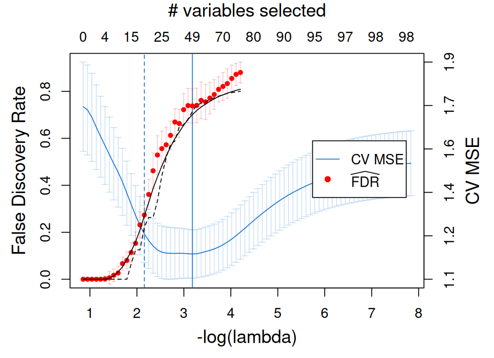

# Demo version of FDR estimator

## Installation

```
if (!require("devtools")){
    install.packages("devtools")
}
devtools::install_github("yixiangluo/hFDR")
```

## Simple example with Lasso

We show a simple example with Lasso selection. Please see more examples in the vignettes `GaussianLinear`, `ModelX`, and `GaussianGraph`.

``` r
set.seed(2024)

# Problem parameters
p <- 100           # number of variables
n <- 300           # number of observations
k <- 15            # number of variables with nonzero coefficients
amplitude <- 3   # signal amplitude (for noise level = 1)

# Generate the variables from a multivariate normal distribution
mu <- rep(0,p)
rho <- 0.25
Sigma <- toeplitz(rho^(0:(p-1)))
X <- matrix(rnorm(n*p), n) %*% chol(Sigma)

# Generate the response from a linear model
nonzero <- sample(p, k)
beta <- amplitude * (1:p %in% nonzero) / sqrt(n)
y.sample <- function() X %*% beta + rnorm(n) + 100
y <- y.sample()
```

``` r
library(hFDR)
library(glmnet)
glmnet.cv <- glmnet::cv.glmnet(X, y, alpha = 1, nfolds = 10,
                               intercept = T, standardize = T, family = "gaussian")
                               
# generate lambda sequence
lambda.lower <- max(which(glmnet.cv$cvm <= glmnet.cv$cvup[which.min(glmnet.cv$cvm)]))
lambda <- glmnet.cv$lambda[1:lambda.lower]

# compute FDR estimators with s.e. estimation by Bootstrap (computationally expensive)
hFDR.res <- hFDR(X, y, model = "gausslinear", select = "lasso", lambda = lambda,
                 psi = "pval", se = T, n_sample.se = 10, n_cores = 2)


# Compare with FDR and FDP in the simulation setting
calc_FDP <- function(selected, nonzero){
  p <- NROW(selected)
  nonzero <- (1:p) %in% nonzero
  colSums(selected * !nonzero) / pmax(colSums(selected), 1)
}

FDP <- calc_FDP(select.lasso(X, y, lambda), nonzero)
FDR <- sapply(1:100, function(mc_i){
  y.mc <- y.sample()
  calc_FDP(select.lasso(X, y.mc, lambda), nonzero)
})
FDR <- rowMeans(FDR)

plot(hFDR.res, glmnet.cv)
lines(x = -log(lambda), y = FDP, col = "black", lty = 2)  # dashed black line for FDP
lines(x = -log(lambda), y = FDR, col = "black", lty = 1)  # solid black line for FDR
```


```
For discussion on the choice of lambda and computational efficiency/scalability, please see vignettes/Introduction_and_Scalability.Rmd
```
